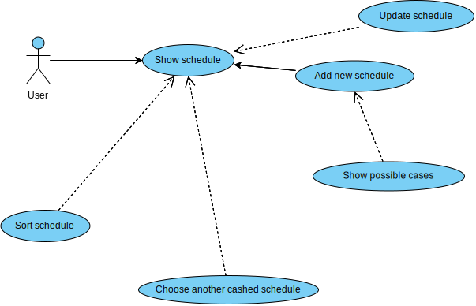

# Проект системы
---

# Содержание
1. [Диаграмма вариантов использования](#usecase) 
1.1 [Актёры](#actors) 
1.2 [Варианты использования](#variant) 
1.2.1 [Посмотреть расписание](#lookvar) 
1.2.2 [Обновить расписание](#updatevar) 
1.2.3 [Выбрать расписание](#choosevar) 
1.2.4 [Сортировать расписание](#sortvar) 
1.2.5 [Добавить расписание](#addvar) 
1.2.6 [Показ доступных расписаний](#showposcvar) 
2. [Диаграммы активностей](#activity)  
2.1 [Диаграмма добавления расписания](#addsch) 
2.2 [Диаграмма удаления расписания](#deletesch) 
2.3 [Диаграмма сортировки расписания](#sortsch) 
2.4 [Диаграмма обновления расписания](#updatesch) 
3. [Диаграмма последовательностей](#sequences) 
4. [Диаграмма классов](#classdiag) 
5. [Диаграмма состояний](#statediag) 
6. [Диаграмма развертывания и компонентов](#deploydiag) 

<a name="usecase"/>

# 1. Диаграмма вариантов использования

<a name="actors"/>

## 1.1 Актёры
 
**Актёр User** - это пользователь этого приложения 

<a name="variant"/>

## 1.2 Варианты использования

<a name="lookvar"/>

### 1.2.1 Посмотреть расписание
**Описание:** используется для просмотра расписания

<a name="updatevar"/>

### 1.2.2 Обновить расписание
**Описание:** используется для обновления расписания

<a name="choosevar"/>

### 1.2.3 Выбрать расписание
**Описание:** используется для выбора расписания

<a name="sortvar"/>

### 1.2.4 Сортировать расписание
**Описание:** используется для сортировки расписания по дате, неделе,   
дню недели, подргуппе и другим критериям

<a name="addvar"/>

### 1.2.5 Добавить расписание
**Описание:** используется для добавления расписания

<a name="showposcvar"/>

### 1.2.6 Показ доступных расписаний
**Описание:** показывает пользователю доступные расписания,  
совпадающие с критерием поиска

<a name="activity"/>

# 2. Диаграммы активностей

<a name="addsch"/>

## 2.1 Диаграмма добавления расписания

<a name="deletesch"/>

## 2.2 Диаграмма удаления расписания

<a name="sortsch"/>

## 2.3 Диаграмма сортировки расписания

<a name="updatesch"/>

## 2.4 Диаграмма обновления расписания

<a name="sequences"/>

# 3. Диаграмма последовательностей

<a name="classdiag">

# 4. Диаграмма классов

<a name="statediag">

# 5. Диаграмма состояний

<a name="deploydiag">

# 6. Диаграмма развертывания и компонентов

