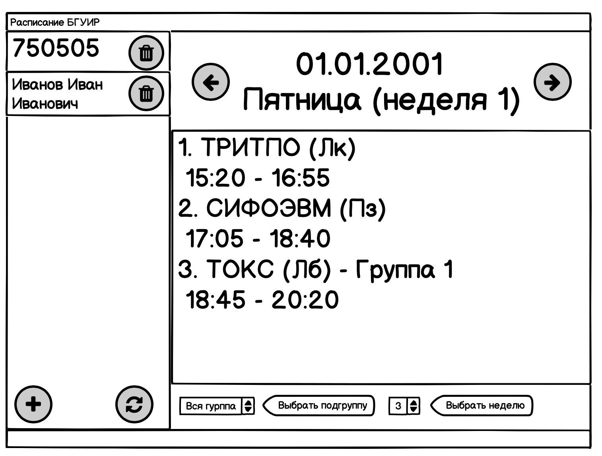
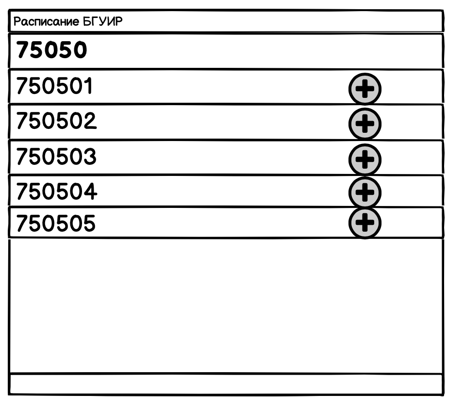

#  Требования к проекту

---

# Содержание
1 [Введение](#intro)  
1.1 [Бизнес-требования](#business_requirements)  
1.1.1 [Исходные данные](#given_data)  
1.1.2 [Возможности бизнеса](#business_opportunities)  
1.1.3 [Границы проекта](#project_limit)  
1.2 [Аналоги](#analogues)  
2 [Требования пользователя](#user_requirements)  
2.1 [Программные интерфейсы](#program_interfaces)  
2.2 [Интерфейс пользователя](#user_interface)  
2.3 [Аудитория приложения](#users)   
2.3.1 [Целевая аудитория](#target_users)  
2.3.2 [Побочная аудитория](#another_users)  
2.4 [Предположения и зависимости](#dependencies)  
3 [Системные требования](#system_requirements)  
3.1 [Функциональные требования](#functional_requirements)  
3.1.1 [Основные функции](#main_functions)  
3.1.1.1 [Добавление группы](#add_group)  
3.1.1.2 [Добавление преподавателя](#add_teacher)  
3.1.1.3 [Просмотр расписания](#look_schedule)  
3.1.1.4 [Обновление расписания](#up_to_date_schedule)   
3.2 [Нефункциональные требования](#non_functional_requirements)  
3.2.1 [Атрибуты качества](#quality_attributes)  
3.2.1.1 [Требования к удобству использования](#requirements_for_easy_use)  
3.2.2 [Внешние интерфейсы](#external_interfaces)  
3.2.3 [Ограничения](#restrictions) 

<a name="intro"/>

# 1 Введение
 
<a name="business_requirements"/>
 
## 1.1 Бизнес-требования
 
<a name="given_information"/>
 
### 1.1.1 Исходные данные
Студенты и сотрудники БГУИР чаще всего обращаются к расписанию, используя мобильные приложения или портал в сети интернет.
Однако нет отдельного решения на персональных компьютерах (далее, ПК). Данное приложение призвано помочь студентам
в быстром ознокомлении с расписанием на ПК.
 
<a name="business_opportunities"/>

### 1.1.2 Возможности бизнеса
Многие студенты и сотрудники БГУИР вынуждены работать на персональных компьютерах, а значит 
персональные компьютеры, не рассматривая конкретные ОС, являются самой популярной 
платформой среди данной группы людей. Кроссплатформенность позволит 
увеличить количество потенциальных пользователей.

<a name="project_limit"/>

### 1.1.3 Граница проекта
Приложение "Расписание БГУИР" позволит пользователям смотреть расписание 
БГУИР через приложение, с возможностью сохранить выбранные групы и преподавателей.

<a name="analogues"/>

## 1.2
Обзор аналогов представлен в 
[отдельном документе](../requirements/Обзор%20аналогов.md).

<a name="user_requirements"/>

# 2 Требования пользователя

<a name="program_interface"/>

## 2.1 Програмные интерфейсы
Приложение использует API сервера БГУИР, а именно делает HTTP запросы на сервер и получает JSON ответ.

<a name="user_interface"/>

## 2.2 Интерфейс пользователя
Главное окна.

Окно добавления группы и преподователя.

<a name="users"/>

## 2.3 Аудитория приложения

<a name="target_users"/>

### 2.3.1 Целевая аудитория
Студенты и сотрудники БГУИР.

<a name="another_users"/>

### 2.3.2 Побочная аудитория
Абитуриенты.

<a name="dependencies"/>

## 2.4 Предположения и зависимости
Приложение может выдавать устаревшую информацию без сети интернет
для сохраненных преподавателей и групп и не работать для несохраненных
групп и преподавателей.

<a name="system_requirements"/>

# 3 Системные требования

<a name="functional_requirements"/>

## 3.1 Функциональные требования

<a name="main_functions"/>

### 3.1.1 Основные функции

<a name="add_group"/>

#### 3.1.1.1 Добавление группы
**Описание.** Пользователь имеет возможность добавить или удалить
 интересующие его группы.
 
| Функция | Требования |
|:---|:---|
| Добавление группы | Приложение должно давать список, а также поиск по нему, в котором будут номера групп |
| Удаление группы | Приложение должно по запросу пользователя удалять выбранную группу |

<a name="add_teacher"/>

#### 3.1.1.2 Добавление преподавателя
**Описание.** Пользователь имеет возможность добавить или удалить
 интересующего его преподавателя.
 
| Функция | Требования |
|:---|:---|
| Добавление преподавателя | Приложение должно давать список, а также поиск по нему, в котором будут ФИО преподавателей |
| Удаление группы | Приложение должно по запросу пользователя удалять выбранного преподавателя |

<a name="look_schedule"/>

#### 3.1.1.3 Просмотр расписания
**Описание.** Пользователь может просмотреть расписание интересующего его
преподавателя или группы.

| Функция | Требования |
|:---|:---|
| Просмотр | Приложение должно показывать пользователю расписание |
| Выбор подгруппы | Приложение должно давать возможность отсортировать расписание для определенной подгруппы |
| Выбор недели | Приложение должно давать возможность отсортировать расписание для определенной недели |

<a name="up_to_date_schedule"/>

#### 3.1.1.4 Обновление расписания
**Описание.** Приложение должно проверять наличие свежего расписания из сети интернет при 
наличии доступа к сети и предлагать пользователю его обноваить. Также пользователь сам может инициировать обновление расписания.

<a name="quality_attributes"/>

### 3.2.1 Атрибуты качества

<a name="requirements_for_ease_of_use"/>

#### 3.2.1.1 Требования к удобству использования
1. Доступ к основным функциям приложения не более чем за две операции;
2. Все функциональные элементы пользовательского интерфейса имеют названия, описывающие действие, которое произойдет при выборе элемента;
3. Пошаговая инструкция использования основных функций приложения отображена в справке;

<a name="external_interfaces"/>

### 3.2.2 Внешние интерфейсы
Окна приложения удобны для использования пользователями с плохим зрением:
  * размер шрифта не менее 14пт;
  * функциональные элементы контрастны фону окна.
  * поддержка черной темы
  
### 3.2.3 Ограничения
1. Приложение реализовано на платформе Python 3.7;
2. Наличие ресурсов, хранящихся локально.
